# 🔃 Demonstration Adaptor Guide

The ***AirExo*-2** system addresses the visual gap through its demonstration adaptor:

1. Utilizes specialized adaptors to transform in-the-wild observations into pseudo-robot observations.
2. Implements an **operation space adaptor** to unify coordinate systems across different demonstrations.
3. Integrates **image and depth adaptors** to remove human embodiment information, generating photorealistic robot images while preserving spatial consistency.

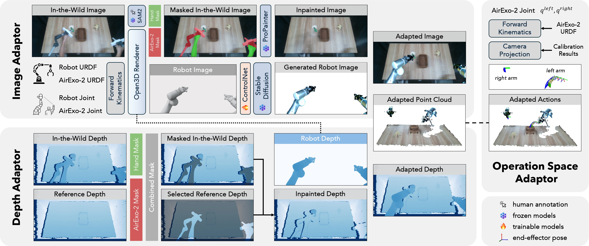


## 🖼️ Image Adaptor

The image adaptor processes visual information through a comprehensive pipeline to transform in-the-wild images into realistic robot demonstrations, as illustrated in the figure above.

### 🛠️ Setup and Initial Rendering
This script integrates the ***AirExo*-2** model into the Open3D rendering engine using recorded encoder readings and [calibrated transformations](CALIB.md) between the global camera and the ***AirExo*-2** base. The system generates both ***AirExo*-2** and corresponding dual-arm robot RGB-D and mask images, leveraging the one-to-one joint mapping between them.


<p align="center">
  
</p>

<div align="center">
<table>
  <tr>
  <td>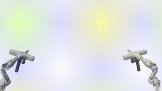</td>
  <td>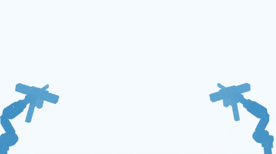</td>
  <td>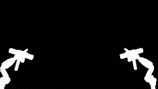</td>
  </tr>
  <tr>
  <td align="center"> AirExo Color</td>
  <td align="center"> AirExo Depth</td>
  <td align="center">AirExo Mask</td>
  </tr>
</table>
</div>


<div align="center">
<table>
  <tr>
  <td>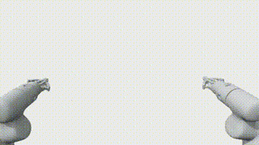</td>
  <td>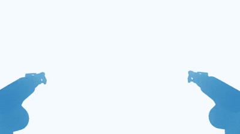</td>
  <td>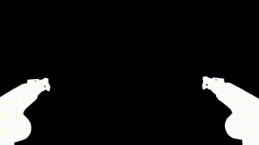</td>
  </tr>
  <tr>
  <td align="center"> Robot Color</td>
  <td align="center"> Robot Depth</td>
  <td align="center">Robot Mask</td>
  </tr>
</table>
</div>


```bash
conda activate airexo
bash airexo/scripts/render.sh
```
- `base_path`: Path containing all demonstration data.
- `scene_name` Specific demonstration scenario to process.


### 🎭 Mask Generation

Initially, we employ [SAM2](https://github.com/facebookresearch/sam2) to create consistent and precise hand masks throughout the entire demonstration video sequence. Detailed usage instructions can be found in [SAM2.md](./SAM2.md). 

<div align="center">
    <table style="margin: 0 auto; text-align: center;">
    <tr>
        <td>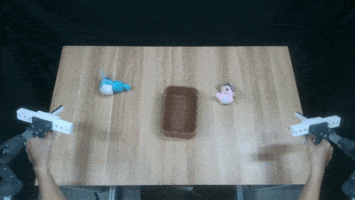</td>
        <td>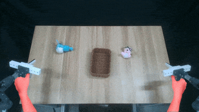</td>
        <td>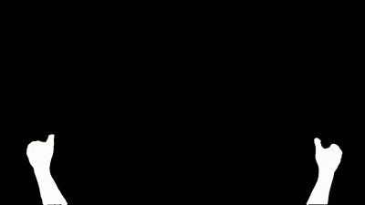</td>
    </tr>
    <tr>
        <td align="center">In-the-Wild Demonstration</td>
        <td align="center">Mask Process</td>
        <td align="center">Mask Result</td>  </tr>
    </table>
</div>

These high-quality masks are subsequently combined with ***AirExo*-2** masks generated during the rendering process, effectively identifying all regions that require adaptation in the later inpainting and image generation stages of the pipeline.

### 🤖 Image Generation
Inspired by advanced visual transformation techniques, we fine-tune a pre-trained [Stable Diffusion 1.5](https://github.com/CompVis/stable-diffusion) model with [ControlNet](https://github.com/lllyasviel/ControlNet) to generate photorealistic robot images from the rendered robot images. 

#### Preparation

First collect training samples through random "play" movements in an empty workspace while recording RGB-D images. These samples are **platform-specific** but **task-invariant** (only needed once per robot platform). Then generate corresponding simulation images using the `render.sh` script to create paired real-simulated robot image sets for controlnet training.

<div align="center">
    <table style="margin: 0 auto; text-align: center;">
    <tr>
        <td></td>
        <td>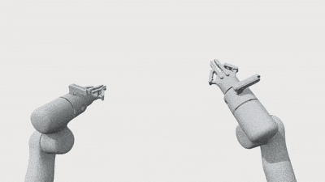</td>
    </tr>
    <tr>
        <td align="center">Camera</td>
        <td align="center">Rendered Robot Image</td>
    </tr>
    </table>
</div>

#### Training

Navigate to the [ControlNet directory](../../utils/controlnet/) and start training:

```bash
conda activate airexo
cd utils/controlnet
bash train.sh
```

- `camera_dir`: Directory containing real robot camera images
- `render_dir`: Directory containing rendered robot images
- `output_dir`: Directory to save training checkpoints
- `resume_path`: Path to a pre-trained checkpoint for finetuning
- `prompt`: Text prompt for stable diffusion training

#### Inferencing

After training, generate photorealistic robot images:

```bash
conda activate airexo
bash airexo/scripts/controlnet_inference.sh
```

For detailed configuration options, please refer to the [Adaptor Configuration Guide](./CONFIG.md#-image-generation).

These generated images will be used in the subsequent steps to create the final adapted demonstrations.

### 🎨 Color Inpainting and Pseudo-Robot Image Generation
We then apply the pre-trained video inpainting model [ProPainter](https://github.com/sczhou/ProPainter) to fill in the masked areas, effectively removing human embodiment information from the images to generate agent-agnostic images. The generated robot images are then extracted using the robot mask and superimposed onto the inpainted images, producing the final pseudo-robot images with high visual fidelity.

<div align="center">
    <table style="margin: 0 auto; text-align: center;">
    <tr>
        <td></td>
        <td></td>
        <td></td>
    </tr>
    <tr>
        <td align="center">In-the-Wild Demonstration</td>
        <td align="center">After Inpainting</td>
        <td align="center">Pseudo-Robot Demonstration</td>
    </tr>
    </table>
</div>


```bash
conda activate airexo
bash airexo/scripts/image_adaptor.sh
```

For detailed configuration options, please refer to the [Adaptor Configuration Guide](./CONFIG.md#-color-inpainting).

## 📏 Depth Adaptor
For depth adaptation, we first capture a reference depth image of the empty workspace using the same camera setup, serving as a universal background reference.

<div align="center">
  <table>
    <tr>
      <td></td>
      <td>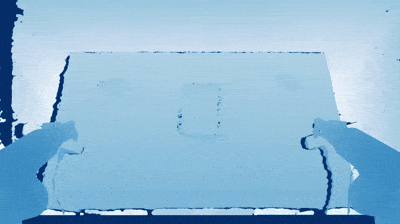</td>
    </tr>
    <tr>
      <td align="center">In-the-Wild Demonstration</td>
      <td align="center">Pseudo-Robot Demonstration</td>
    </tr>
  </table>
</div>

```bash
conda activate airexo
bash airexo/scripts/depth_adaptor.sh
```

For detailed configuration options, please refer to the [Adaptor Configuration Guide](./CONFIG.md#-depth-adaptor).

## 🦾 Operation Space Adaptor

The operation space adaptor addresses coordination challenges by projecting all states and actions into the global camera coordinate system using calibration results. This crucial transformation ensures that demonstrations captured in different environments can be accurately interpreted by the robot.

The operation space adaptor is implemented in the dataset transformation process. Please refer to [the dataset transformation guide](TRANSFORM.md) for more details.