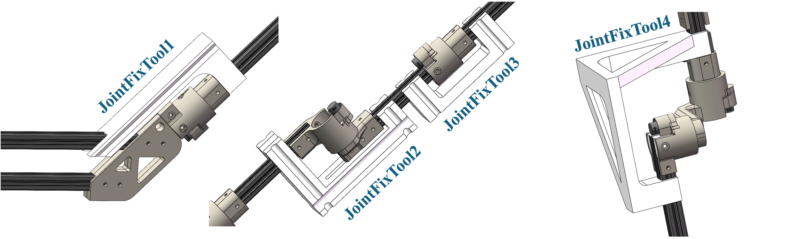
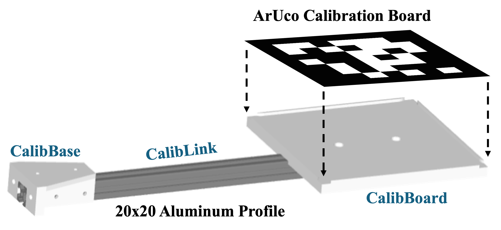
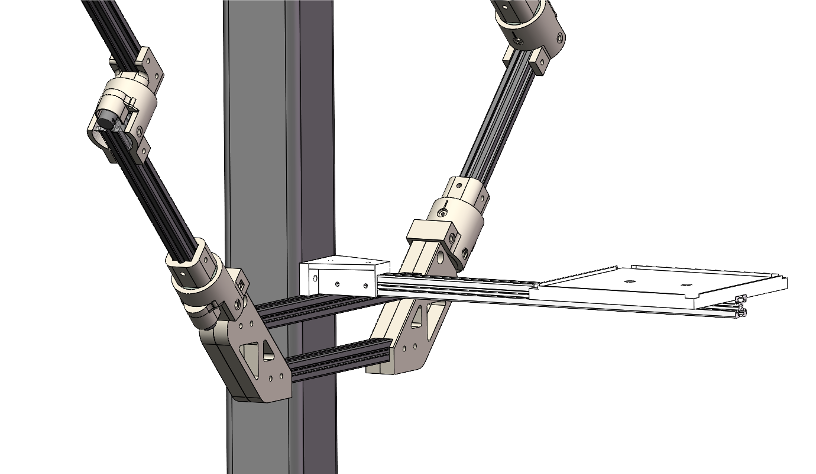
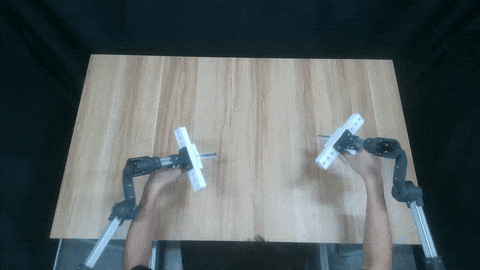
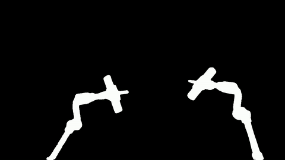
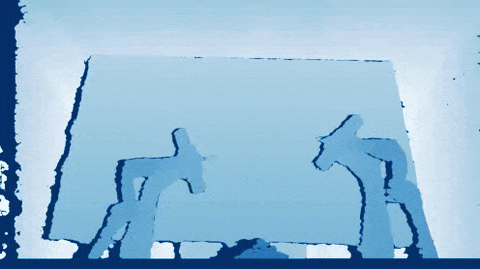
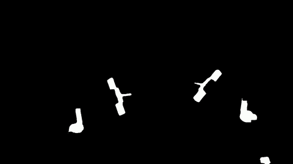
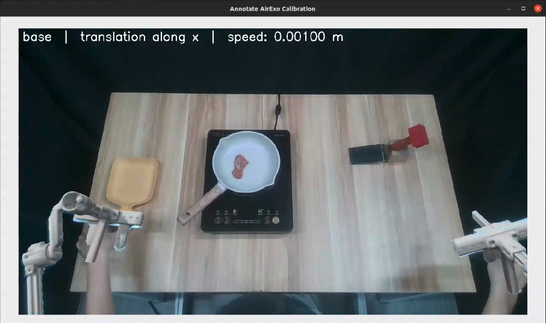

# 📷 ***AirExo*-2** Calibration Guide

The ***AirExo*-2** system requires two types of calibration simultaneously:
1. aligning the zero positions of each joint with the corresponding robot joint;
2. determining the transformation between the global camera and the ***AirExo*-2** base. 

To address these challenges, we propose a two-stage calibration process.

## 1️⃣ Initial Calibration

In the first stage, we aim to obtain the initial calibration results. 

1. For the exoskeleton calibration, we provide a set of 3D-printed tools that can fix the joints of ***AirExo*-2** near the zero position (or the anchor value). After fixing the joint position, one can obtain the joint calibration result by reading the encoder values of the corresponding joint.

   We provide four types of 3D-printed joint fix tools for our robot platform (bimanual Flexiv Rizon 4). You can modify the joint fix tools for your own robot platform.

   <p align="center">
     
   </p>

   Here we provide the function of each joint fix tool in initial calibration.

   | Model File                                            | Joint           |
   | ----------------------------------------------------- | --------------- |
   | [`JointFixTool1`](../models/calib/JointFixTool1.STEP) | Joint1          |
   | [`JointFixTool2`](../models/calib/JointFixTool2.STEP) | Joint2, Joint4  |
   | [`JointFixTool3`](../models/calib/JointFixTool3.STEP) | Joint3, Joint5  |
   | [`JointFixTool4`](../models/calib/JointFixTool4.STEP) | Joint6 + Joint7 |
   
   Put the calibration results into the following configuration files following [the configuration guide](CONFIG.md#-joint-calibration):

   + `airexo/configs/joint/left/calib.yaml`
   + `airexo/configs/joint/right/calib.yaml`

2. For the camera calibration, we attach an ArUco calibration marker board with a known position on the ***AirExo*-2** base and perform optical calibration using OpenCV. 

   We use the 7x7 ArUco marker of marker ID 0 and marker size 150mm. Generate the ArUco marker [here](https://chev.me/arucogen/), or directly download [the SVG file](../image/calib/aruco.svg). We recommend making a 170mm x 170mm x 3mm aluminum oxide calibration board with high precision, placing the ArUco marker at its exact center.

   Then, print [`CalibBase`](../models/calib/CalibBase.STEP) and [`CalibBoard`](../models/calib/CalibBoard.STEP), select a 20x20 European standard aluminum profile with a suitable length (in our case, 450mm), assemble the three components together following [`CalibrationTool`](../models/calib/CalibrationTool.STEP), and place the calibration board on `CalibBoard`.
   
   <p align="center">
     
   </p>

   Finally, install the assembled calibration tool to the ***AirExo*-2** as follows.
   
   <p align="center">
     
   </p>

   For this mounting method (with the linking alumium profile 450mm), the transformations from marker coordinates to the ***AirExo*-2** base is pre-defined in [`airexo/helpers/constants.py` (L61)](../../airexo/helpers/constants.py#L61). For other mounting methods, you may need to re-calculate the transformation matrix and put the results in the [`AIREXO_BASE_TO_MARKER`](../../airexo/helpers/constants.py#L61) constant value.

3. Then, write your own configurations following [the configuration guide](CONFIG.md#1️⃣-initial-calibration) and execute the following calibration script to obtain results.

   ```bash
   python -m airexo.calibration.main --config-name=airexo
   ```

   The calibration results are saved in a numpy file with timestamp as its filename in your specified saving folders.

## 2️⃣ Calibration via Differentiable Rendering

The initial calibration introduces errors to the calibration results due to human observation, calibration board misalignment, and optical inaccuracies. Therefore, we need to further refine it in this stage. 

### 🛢️ Data Collection

To collect calibration data, please refer to [the in-the-wild data collection guide](../../README.md#️-data-collection-2-in-the-wild). During in-the-wild data collection, we recommend to 
- use an empty background for annotation simplicity;
- keep your arms and hands below the exoskeleton (except for the gripper part) to ensure a complete mask for segmentation;
- collect one demonstrations with various exoskeleton poses.

Here is the sample demonstration for constructing the calibration dataset.

<div align="center">
<table>
  <tr>
  <td></td>
  <td></td>
  </tr>
  <tr>
  <td align="center">RGB</td>
  <td align="center">Depth</td>
  </tr>
</table>
</div>

### 📝 Data Annotation and Preparation

After collecting one demonstration, sample several representative frames (with various exoskeleton poses) from the demonstration to obtain training samples. For each training sample, 

- use [SAM-2](https://github.com/facebookresearch/sam2) to generate a mask for ***AirExo*-2**, saved as `mask.png`. The exoskeleton handle and the gripping areas are excluded in the URDF file in [`airexo/urdf_models/airexo/airexo_no_handle.urdf`](../../airexo/urdf_models/airexo/airexo_no_handle.urdf) (this URDF file is just for calibration use), thus please also exclude these parts in the mask annotation process. This mask is used to calculate the mask loss between the it and the rendered ***AirExo*-2** mask. We recommend to dilate the annotated mask with a kernel size of 1.
- use [SAM-2](https://github.com/facebookresearch/sam2) to generate a depth mask for ***AirExo*-2**, saved as `depth_mask.png`. In this mask, you need to select flat surfaces of the ***AirExo*-2** that have accurate depth values. These depth values are used to calculate masked depth loss between rendered depth and the real depth. We recommend to erode the annotated mask with a kernel size of 6.
- extract the depth frame of the training sample, saved as `depth.png`.
- extract the encoder readings of the left ***AirExo*-2** arm, saved as `left.npy`.
- extract the encoder readings of the right ***AirExo*-2** arm, saved as `right.npy`.

<div align="center">
<table>
  <tr>
  <td></td>
  <td></td>
  <td></td>
  <td></td>
  </tr>
  <tr>
  <td align="center">RGB</td>
  <td align="center"><b><i>AirExo</i>-2</b> Mask</td>
  <td align="center">Depth</td>
  <td align="center">Depth Mask</td>
  </tr>
</table>
</div>

Put these files in the training sample folder. Then put all the training sample folders in one dataset folder, organized as follows.

```
calib_dataset/              # calibration dataset
|-- sample_0001/            # the 1st sample
|   |-- mask.png            # the AirExo-2 mask
|   |-- depth_mask.png      # the depth mask
|   |-- depth.png           # the depth image
|   |-- left.npy            # the left encoder readings of AirExo-2
|   `-- right.npy           # the right encoder readings of AirExo-2
|-- sample_0002/
|-- ...
`-- sample_0040/            # 40~50 samples are enough for refining calibration.
```

### 🏋️ Training

Write your own configurations following [the configuration guide](CONFIG.md#2️⃣-calibration-via-differentiable-rendering) and execute the following calibration script to perform refinement via differentiable rendering.

```bash
python -m airexo.calibration.main --config-name=[path to your configurations]
```

The calibration results are saved in a numpy file with timestamp as its filename in your specified saving folders.

### 📊 Results

The refined calibration results will be saved as a folder in the specified path. The npy file named with timestamp is the camera calibration results, while `calib_left.yaml` and `calib_right.yaml` are the joint calibration results. Please put the camera calibration results in the corresponding calibration folder, and replace the original joint calibration results with the refined ones.

## 👀 (Optional) Calibration Visualizer & Annotator

We also provide tools to visualize the calibration results from (1) the real-time camera stream and the real-time ***AirExo*-2** joint encoder readings, and (2) the recorded in-the-wild demonstrations. During this process, you can also annotate the calibration results manually. Please follow [the configuration guide](CONFIG.md#-optional-calibration-visualizer--annotator) to set up the configuration files. Then, execute the one of the following commands for visualization & human annotation.

```bash
python -m airexo.calibration.main --config-name=airexo_annotator_cam  # (1)
python -m airexo.calibration.main --config-name=airexo_annotator_data  # (2)
```

<div align="center">
    <table style="margin: 0 auto; text-align: center;">
    <tr>
        <td></td>
        <td></td>
    </tr>
    <tr>
        <td align="center">Sample Visualization / Annotation</td>
        <td align="center">Sample Visualization / Annotation</td>
    </tr>
    </table>
</div>

<br>

You can use your keyboard to annotate the calibration results. On the top of the visualization window, you can see the current calibration mode and the axis/joint being adjusted.
- `q`: save the current annotation results and quit the annotation process.
- `b`: enter the base calibration annotation mode: annotate the base-to-camera calibration results.
- `l`: enter the left calibration annotation mode: annotate the left-arm joint calibration results.  
- `r`: enter the right calibration annotation mode: annotate the right-arm joint calibration results.
- `1 - 7`: for left/right calibration mode, this specifies the joint ID to be annotated; for base calibration mode, `1 - 3` refer to the X/Y/Z translation annotation, and `4 - 6` refer to the X/Y/Z rotation annotation, `7` is unused.
- `-`: Decrease the annotation speed by the specified step.
- `=`: Increase the annotation speed by the specified step.
- `[`: Adjust the calibration results according to the determined negative direction.
- `]`: Adjust the calibration results according to the determined positive direction.
- `n`: Adjust the visualziation coefficient: increase the transparency value of the rendered ***AirExo*-2**.
- `m`: Adjust the visualziation coefficient: decrease the transparency value of the rendered ***AirExo*-2**.
- (for (2) only) `,`: Visualize and annotate the previous data frame.
- (for (2) only) `.`: Visualize and annotate the next data frame.

The calibration results are also saved in a numpy file with timestamp as its filename in your specified saving folders. 