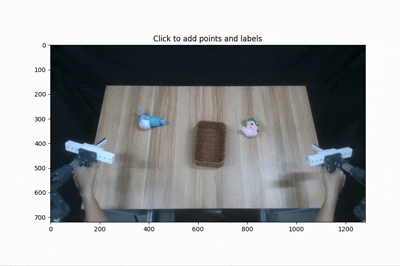

# 🎭 Sam-2 Usage

We leverage [SAM-2](https://github.com/facebookresearch/sam2) to generate consistent masks throughout demonstration videos, ensuring reliable segmentation across frames.

<div align="center">
    <table style="margin: 0 auto; text-align: center;">
    <tr>
        <td></td>
        <td></td>
        <td></td>
    </tr>
    <tr>
        <td align="center">Airexo Play</td>
        <td align="center">Mask Process</td>
        <td align="center">Mask Result</td>  </tr>
    </table>
</div>


## 🛠️ Environment Setup

Create the `sam2` conda environment and install all required packages as specified in the  [DEPENDENCIES](./DEPENDENCIES.md) file.

## 🚀 Running the Mask Generation

Navigate to the [mask generation](../../utils/sam2/) directory:

```bash
cd utils/mask
python main.py
```

The mask generation process is controlled by parameters in [default.yaml](../../utils/sam2/config/default.yaml):

- `input_data_root`: The base directory containing all demonstration data.
- `scene_name`: Specifies which demonstration scene to process (e.g., "scene_0036")
- `camera_id`: Identifies the specific camera used for recording (e.g., "cam_104122061602").
- `prefix`: Defines the subfolder path where RGB images are stored relative to the scene directory.
- `tmp_dir`: Directory where intermediate processing files and temporary masks are stored during generation.
- `visualize_dir`: Main output directory where processed results will be saved. Often set to the same as `input_data_root`.
- `visualize_name`: Subfolder path within the scene directory where final mask outputs will be stored.
- **Input images**: Located at `input_data_root/scene_name/prefix/`. For example, if working with `scene_0036`, RGB images would be found at `/data/train/scene_0036/cam_104122061602/color/`.
- **Mask outputs**: For each RGB image, a corresponding mask is generated and stored at `visualize_dir/scene_name/visualize_name/`. The system maintains the same filename structure between input and output to ensure easy matching.


## 🖱️ Interactive Controls
<p align="center">
  
</p>

- **Left-click**: Add points for inclusion in the mask
- **Right-click**: Add points that should be excluded from the mask
- **Press 'z'**: Undo previous point selections

## 🔍 Model Finetuning
For improved performance on specific objects or scenarios, the SAM-2 model can be finetuned. This approach is particularly valuable when consistently segmenting task-specific objects that present challenges for the base model.

Detailed finetuning procedures are available in the [SAM-2 repository](https://github.com/facebookresearch/sam2). For domain-specific adaptations, we recommend following their finetuning guidelines with a small set of manually annotated examples from your particular task domain.

